# High-Level Architecture Diagram

**Scope:** a single system diagram covering the whole DriveUp stack as it exists today — Angular
frontend, Spring Boot API, PostgreSQL, and the SePay/VietQR payment webhook — plus the two request flows
worth tracing end to end. For per-file implementation detail, see
[`docs/backend-specification.md`](backend-specification.md) and
[`docs/ui-specification.md`](ui-specification.md); for the payment flow specifically, see
[`docs/deployment/sepay-payment-workflow.md`](deployment/sepay-payment-workflow.md).

Live: frontend at `https://website-register-roan.vercel.app` (Vercel), backend at
`https://backed-website-register.onrender.com` (Render), database on Neon.

---

## System diagram

```mermaid
%%{init: {"theme":"base","themeVariables":{"primaryColor":"#eaf0ff","primaryBorderColor":"#2b5fff","primaryTextColor":"#12172b","lineColor":"#5b6478","secondaryColor":"#fff1e6","secondaryBorderColor":"#f97316","tertiaryColor":"#f1f6ff","tertiaryBorderColor":"#8aa4ff","fontFamily":"-apple-system, Segoe UI, Helvetica Neue, Arial, sans-serif","fontSize":"14px","clusterBkg":"#fbfcff","clusterBorder":"#c9d2ec"}}}%%
flowchart LR
    subgraph Users["USERS"]
        Visitor["Public visitor"]
        Admin["Admin"]
    end

    subgraph Frontend["FRONTEND — Vercel<br/>Angular 19, standalone components"]
        SPA["clientUI SPA<br/>JWT held in localStorage"]
    end

    subgraph Backend["BACKEND — Render (Docker)<br/>Spring Boot 3.4 / Java 21"]
        direction TB
        Sec["RateLimitingFilter →<br/>JwtAuthenticationFilter"]
        Ctrl["Controller<br/>thin — validate, delegate"]
        Svc["Service<br/>@Transactional business logic"]
        Repo["Repository<br/>Spring Data JPA"]
        Sec --> Ctrl --> Svc --> Repo
    end

    subgraph DB["DATABASE — Neon"]
        PG[("PostgreSQL<br/>Flyway V1–V6")]
    end

    subgraph Payments["PAYMENTS — SePay / VietQR"]
        QR["img.vietqr.io<br/>static QR image"]
        SePayNode["SePay<br/>bank-account monitor"]
    end

    Visitor -- HTTPS --> SPA
    Admin -- HTTPS --> SPA
    SPA -- "REST / JSON<br/>Bearer JWT" --> Sec
    SPA -. loads QR image .-> QR
    Repo -- JDBC --> PG
    SePayNode -- "POST /api/webhooks/sepay<br/>shared-secret header" --> Sec

    classDef ext fill:#fff1e6,stroke:#f97316,color:#12172b;
    class QR,SePayNode ext
```

Dashed edge = a browser-side image load (the backend never proxies the QR image, it only builds the
URL). Solid edges into the backend flow through the security filter chain before reaching a controller.

---

## Two request flows worth tracing

### Ordinary API request

1. Browser sends a request to the API origin, with a JWT bearer token on admin routes (attached
   automatically by an Angular interceptor).
2. `RateLimitingFilter` checks a per-IP window on the two public mutating routes
   (`/api/submissions`, `/api/auth/login`).
3. `JwtAuthenticationFilter` validates the token and populates the security context for
   `/api/admin/**`.
4. Controller validates the request DTO, calls exactly one service method.
5. Service applies business rules inside a transaction, calls the repository.
6. Repository reads/writes PostgreSQL via Spring Data JPA; the entity is mapped back to a response
   DTO before it ever reaches the controller.

### Tuition payment via SePay

1. Admin opens a submission and generates a payment — the API snapshots the course price and
   returns a VietQR image URL + payment code.
2. The browser loads that QR image directly from `img.vietqr.io`.
3. The student scans it and transfers in their own banking app.
4. SePay, watching the linked bank account, detects the transfer and calls
   `POST /api/webhooks/sepay` with a shared-secret header.
5. The backend matches the payment code, checks the transferred amount against a 90% floor, and
   marks the payment `PAID` — independent of submission status.

---

## Stack

| Layer | Technologies |
|---|---|
| Frontend | Angular 19.2, Angular Material, RxJS, TypeScript |
| Backend | Spring Boot 3.4, Java 21, Spring Security 6 / JWT, Gradle |
| Data & infra | PostgreSQL, Flyway, Docker, Render, Vercel, Neon |
| External services | SePay webhook, VietQR image API |

---

## Where this diagram lives

A styled, interactive version of this same diagram (dark/light theme, DriveUp brand colors) was
generated as a Claude Artifact and is not checked into this repo — this Markdown/Mermaid version is the
one that travels with the code and renders directly on GitHub.
